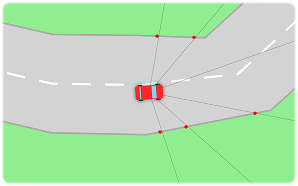

# Car Driver
------------
This demo explores how a neural network can be trained to drive a car around a randomly generated track.

### How it works
------------
A number of cars is spawned at the beginning of a track, each equipped with its own randomly weighted neural
network. Every car has multiple front facing sensors which measures the distance to the nearest side of the
track. This data is normalized in the range of 0.0 to 1.0 and fed to the cars network. The network uses this
input to calculate the amount of gas to apply and the direction to steer.

Every car is given a fitness score of how well they drove around the track. The score is determined by the
distance driven, as well as an added bonus given to the cars that finish the track first. Cars that drive of
the track or uses to much time is terminated.

When all cars have finished the track or been terminated, a genetic breeding process begins. This is chance
driven, giving cars with a high fitness score a higher chance of becoming a parent and producing offspring.
A new generation of cars with new genetics is created and the simulation restarts. The process is repeated
over and over gain, iteratively making the cars better at solving their task.

### How to use it
 ------------
Download as ZIP or clone this repository to try it out. A runnable jar is available in this projects root folder.

#### Controls

 * W,A,S,D:  Drive the user controlled car
 * CTRL - U: Add/remove a user controlled car
 * CTRL - R: Reset the training with new cars
 * CTRL - C: Clear the track of all cars
 * CTRL - T: Create a new random track
 * CTRL - S: Save the tracked car to a file
 * CTRL - O: Open a file chooser to import a saved car
 * CTRL - F: Enable/disable fullscreen
 * SCROLL:   Adjust the camera zoom level
 * SPACE:    Start/stop the simulation
 * ADD/SUB:  Increase/decrease the simulation speed
 * ENTER:    Set the simulation speed to 1